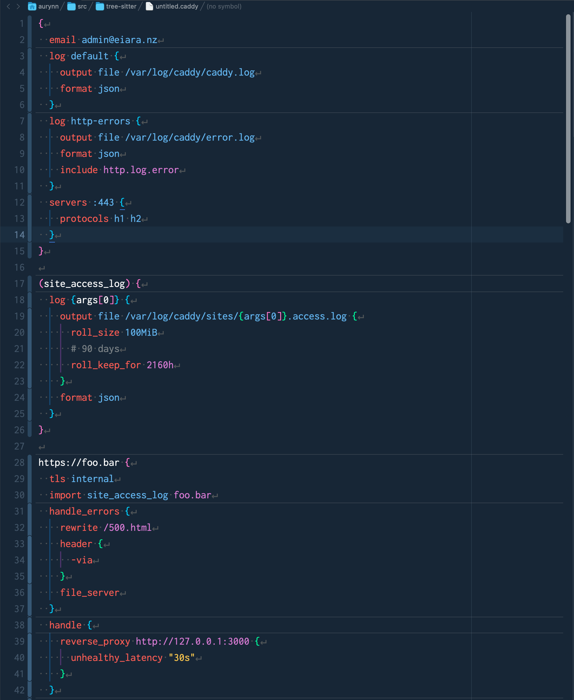
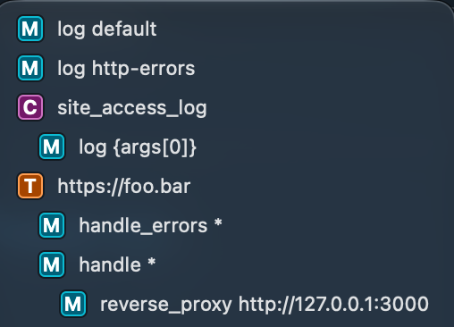

**Caddy** provides syntax highlighting and autocompletion for **the [Caddy](https://caddyserver.com) webserver** configuration files.

## Language Support

Caddy supports symbolization and syntax highlighting for Caddy configuration files.

## About

This extension is licensed under Apache 2.0 as it vendors the official tree-sitter implementation.

"Caddy", and the Caddy icon, are trademarks of Stack Holdings GmbH.